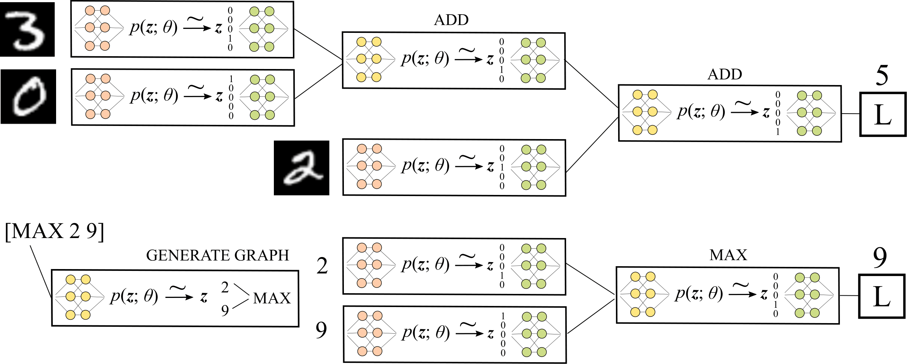

# dccg
This repository contains the PyTorch implementation for the NeurIPS 2021 submission [Efficient Learning of Discrete-Continuous Computation Graphs](https://neurips.cc/Conferences/2021/Schedule?showEvent=27611).

## Efficient Learning of Discrete-Continuous Computation Graphs

With this [paper](), we focus on learning systems comprised of both symbolic and continuous operations where the symbolic operations are modeled as *discrete* probability distributions. In particular, we aim to analyze and improve the training behavior of *complex* computation graphs, that is, graphs with more than one discrete probability distribution in its execution paths.

|  |
|:---|
| Figure 1: Two instances of discrete-continuous computation graphs. Top: The MNIST addition task aims to learn a neuro-symbolic program end-to-end that sums two or more digits only based on raw image inputs. Bottom: The ListOps task aims to learn the solution to an arithmetic expression.|

It is challenging to optimize the parameters of these models, mainly due to insufficient gradient signals often caused by local minima and saturation.
We propose two new methods for mitigating the causes of poor optimization behavior.
First, we show that increasing the scale parameter of the Gumbel noise perturbations improves the models' learning behavior. Increasing the scale parameter increases the probability of escaping local minima during training. Second, we propose dropout residual connections for discrete-continuous computation graphs. By randomly skipping some discrete distributions, we provide more informative gradients throughout the full computation graph.

By setting the Gumbel scale parameter to zero as well as the dropout probability of the residual connections at the beginning of training, we obtain a continuous and deterministic relaxation of the target model. Increasing the dropout probability over time makes the model increasingly use the discrete stochastic nodes. Increasing the Gumbel scale parameter allows the model to escape local minima and small gradients.

In our extensive set of experiments, the aim is threefold. First, we want to analyze the behavior of complex stochastic computations graphs arising in typical application domains such as multi-hop reasoning in knowledge graphs and unsupervised parsing of lists of operations. Second, we want to evaluate the behavior of the stochastic computation graphs when incorporating the proposed methods to improve the vanishing gradient problem. Third, we want to compare the resulting discrete-continuous models with state of the art models which do *not* have stochastic components. Here, we are especially interested in analyzing the generalization (extrapolation) behavior of the models under consideration.

## Citation
```bibtex
@inproceedings{friede21dccg,
  author    = {David Friede and
               Mathias Niepert},
  title     = {Efficient Learning of Discrete-Continuous Computation Graphs},
  booktitle = {NeurIPS},
  series    = {Proceedings of Machine Learning Research},
  publisher = {{PMLR}},
  year      = {2021}
}
```

## Code

#### Requirements
* python==3.7
* pytorch==1.7
* tqdm==4.6

#### Data
For the experiments **Multi-Hop Reasoning over Knowledge Graphs**, please [download](https://worksheets.codalab.org/worksheets/0xfcace41fdeec45f3bc6ddf31107b829f) *wordnet_base*, *freebase_base*, *wordnet_paths* and *freebase_paths* from [Guu et al.](https://arxiv.org/abs/1506.01094) and organize the folders [**wordnet**](data/wordnet) and [**freebase**](data/freebase) in the following way.
```
    data
    ├── listops
    │   ├── dev.json
    │   ├── test.json
    │   ├── test8.json
    │   ├── test10.json   
    │   ├── train1.json
    │   ├── train2.json             
    │   └── vocab.json
    ├── mnist
    │   ├── MNIST
    │   ├── test_data.txt
    │   └── train_data.txt
    :
    ├── freebase
    │   ├── paths
    │   │   ├── dev
    │   │   ├── test
    │   │   └── train
    │   ├── dev.txt
    │   ├── entities.txt   
    │   ├── relation.txt
    │   ├── test.txt
    │   └── train.txt        
    └── wordnet
        ├── paths
        │   ├── dev
        │   ├── test
        │   └── train
        ├── dev.txt
        ├── entities.txt   
        ├── relation.txt
        ├── test.txt
        └── train.txt
```

#### Unsupervised Parsing on ListOps
```
python run_listops.py --tau 1 --temp 1 --residual 1 --cuda 0
```
 `--tau` sets the value for tau \
 `--temp` switches between temperature matching off/on \
 `--residual` switches between dropout residuals off/on \
 `--cuda` switches the device between cpu/cuda


 #### Multi-Hop Reasoning over Knowledge Graphs
 ```
 python run_kg.py --tau 4 --temp 1 --residual 1 --cuda 0 --fb 0 --zero 5
 ```
  `--tau` sets the value for tau \
  `--temp` switches between temperature matching off/on \
  `--residual` switches between dropout residuals off/on \
  `--cuda` switches the device between cpu/cuda \
  `--fb` switches the dataset between wordnet/freebase \
  `--zero` sets the training dataset to paths of length ≤X for the extrapolation task


#### End-to-End Learning of MNIST Addition
```
python run_mnist.py --tau 8 --temp 1 --residual 1 --cuda 0
```
 `--tau` sets the value for tau \
 `--temp` switches between temperature matching off/on \
 `--residual` switches between dropout residuals off/on \
 `--cuda` switches the device between cpu/cuda


## License and Copyright
[SOFTWARE LICENSE AGREEMENT](LICENSE)\
Copyright: The Software is owned by Licensor.
